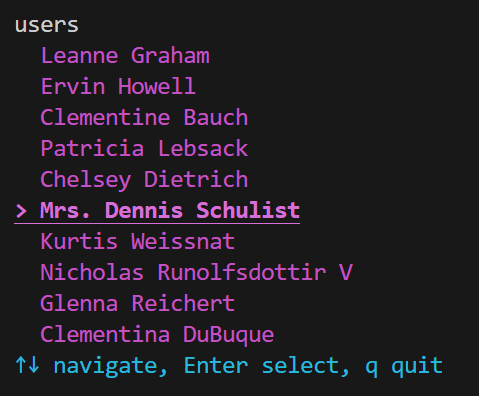
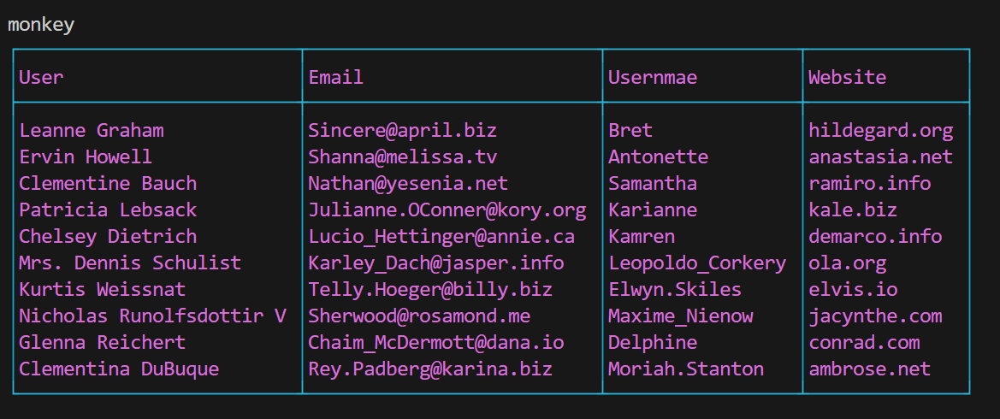

# Cute Line Interface

Welcome to Cute-Line-Interface
Beautiful designs brought to your terminal. This is a small attempt to do what charm did with terminals and TUIs, from scratch. Get all pretty colors, tables and list components in your favourite terminal. Written fully in Go without any external dependencies.

## Features

- Interactive command-line interface with custom commands
- List navigation with arrow keys
- HTTP API integration (fetches user data from JSONPlaceholder)
- Table rendering with customizable colors
- Terminal raw mode for capturing key events
- ANSI color support for styled output





## Requirements

- Go 1.24 or higher

## Installation

Clone the repository and navigate to the project directory:

```bash
git clone https://github.com/DivyanshuShekhar55/cute-line-interface.git
cd cute-line-interface
```

Install dependencies:

```bash
go mod download
```

## Usage

Run the application:

```bash
go run .
```

Once started, you can use the following commands:

- `help` - Display available commands and their descriptions
- `users` - Fetch and display a list of users from JSONPlaceholder API
- `exit` - Exit the terminal (or use Ctrl+C)
- `monkey` - print a pretty table

## Project Structure

- `main.go` - Entry point and main loop
- `command_defs.go` - Command definitions and implementations
- `commands.go` - Command mapping and retrieval
- `repl.go` - Input tokenization
- `list/` - Interactive list component with arrow key navigation
- `utils/` - Utility functions including error logging and ANSI formatting

## API Usage

### List Component

Create an interactive list with arrow key navigation:

```go
import "cute-line-interface/list"

items := []string{"Option 1", "Option 2", "Option 3"}
list.List(items)
```

Navigate with arrow keys, press Enter to select, or q to quit.

### Table Component

Build and render tables with custom colors:

```go
import "cute-line-interface/monkey"

table := monkey.NewTable()
table = table.Header([]string{"Name", "Email", "Username"})
table = table.Row([]string{"John Doe", "john@example.com", "johndoe"})
table = table.Row([]string{"Jane Smith", "jane@example.com", "janesmith"})
table.Render("magentaBright", "cyan")
```

Chain methods to build your table, then render with your choice of colors.

## How It Works

The application runs a read-eval-print loop that accepts user input, tokenizes it, matches it to registered commands, and executes the corresponding callback function. The list component switches the terminal to raw mode to capture individual keystrokes for interactive navigation.

## Dependencies

Belongs to official but extended library.
- `golang.org/x/term` - Terminal control and raw mode
- `golang.org/x/sys` - System-level operations

## License

This project is open source and available for educational purposes.
